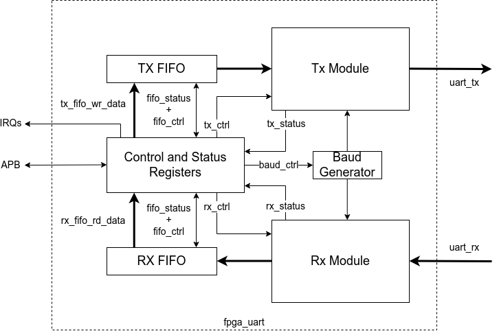

# Simple FPGA UART

## Overview
Simple full-duplex UART for use in FPGA projects. Aim to keep it basic and generic to allow use over multiple platforms. Implemented in Verilog to allow easy compatibility with OS tooling e.g. Yosys.

## Specification

Target Baud rates:
* 9600
* 19200
* 115200
* 256000

Configuration:
* Data width = 5 - 8 bits,
* Stop       = 1 - 3 bits,
* Optional parity bit.

Target support for APB registers for control. 

Configurable FIFO stores Tx/Rx data. 

Interrupts available to indicate status.

## Architecture

